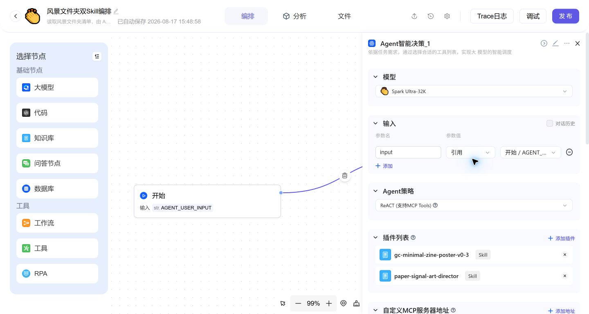
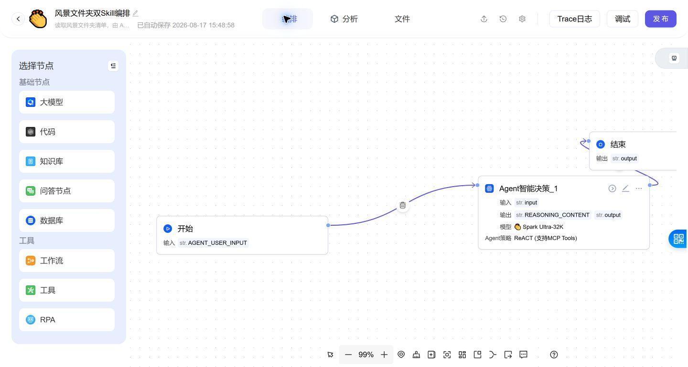
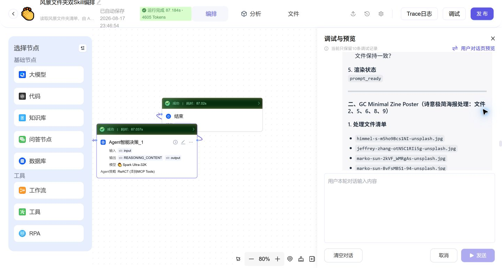

# Astron Agent landscape-folder dual-skill run

Horizontal screenshots from the verified `风景文件夹双Skill编排` run.

- Workflow: Start → Agent Decision → End
- Attached skills: `paper-signal-art-director`, `gc-minimal-zine-poster-v0-3`
- Result: 3 / 3 nodes passed
- Runtime: 87.184 seconds
- Usage: 4,605 tokens

## Agent node with both skills attached

## Workflow canvas

## Successful debug run

Workflow package: [Awesome Astron Workflow](https://github.com/FenjuFu/Awesome-Astron-Workflow/blob/master/assets_source/workflows/astron-landscape-dual-photo-skills.zh-CN.yml)
